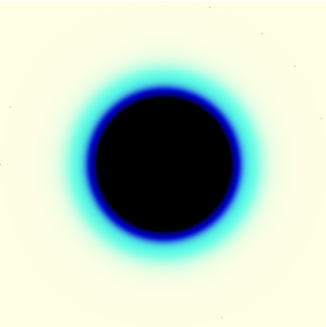

Visualizer
**********

If you want to see what your exoplanet might look like in transit, the
Visualizer module is for you!  Visualizer uses the absorption profile
calculated by the transit depth calculator, which you can get using::

  calculator = TransitDepthCalculator()
  wavelengths, depths, info = calculator.compute_depths(Rs, Mp, Rp, T, full_output=True)

Then, to draw an image::

  color_bins = 1e-6 * np.array([
      [4, 5],
      [3.2, 4],
      [1.1, 1.7]])
  visualizer = Visualizer()
  image, m_per_pix = visualizer.draw(info, color_bins, method='disk')

This maps all wavelengths between 4--5 microns to red, while 3.2--4 microns
maps to green and 4--5 microns maps to blue.  The draw function returns an
image and an image scale, in meters per pixel.  The image can be displayed
with pyplot::

  plt.imshow(image)
  
The 'method' argument can either be 'disk' or 'layers'.  The difference is
illustrated in the example images below.  For purely aesthetic purposes, we
have also made the star light a pale yellow color by passing [1,1,0.8] to the
star_color argument of draw.  
  

	   
   55 Cnc e as a 1D profile
	   

	   
   55 Cnc e as a disk transiting a yellow star

